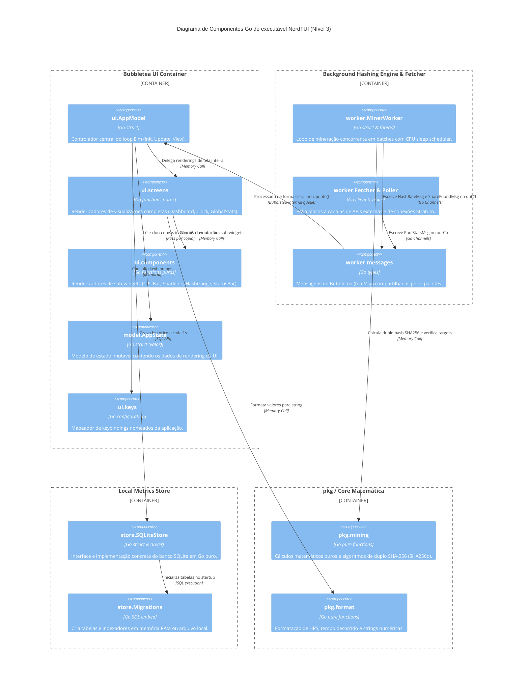

# C4 Diagrama de Componentes (Nível 3) — nerdminertui

> **Módulo:** Arquitetura Global  
> **Nível de Documentação:** COMPLETO  
> **Gerado pelo Arquiteto em:** 2026-05-29

Este diagrama de nível 3 decompõe os componentes e pacotes Go mapeados dentro dos containers de execução do **NerdTUI**.

