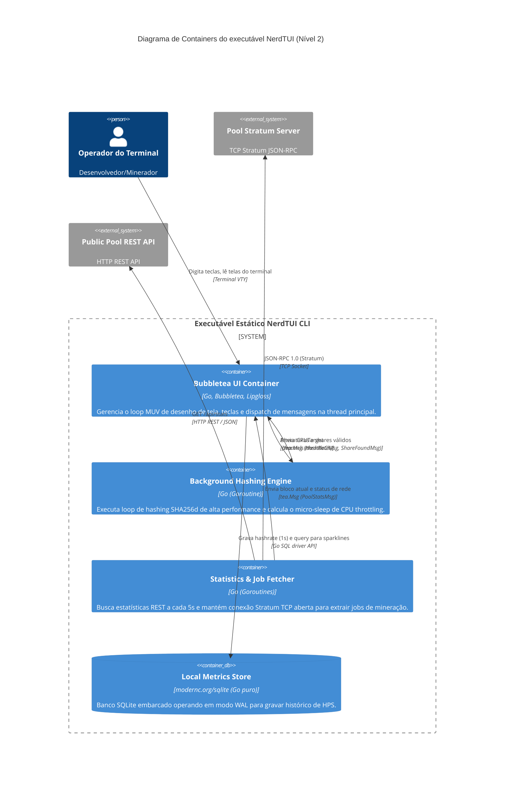

# C4 Diagrama de Containers (Nível 2) — nerdminertui

> **Módulo:** Arquitetura Global  
> **Nível de Documentação:** COMPLETO  
> **Gerado pelo Arquiteto em:** 2026-05-29

Este diagrama detalha os limites lógicos internos do executável do **NerdTUI**, mapeando seus containers funcionais (threads/goroutines e banco).

