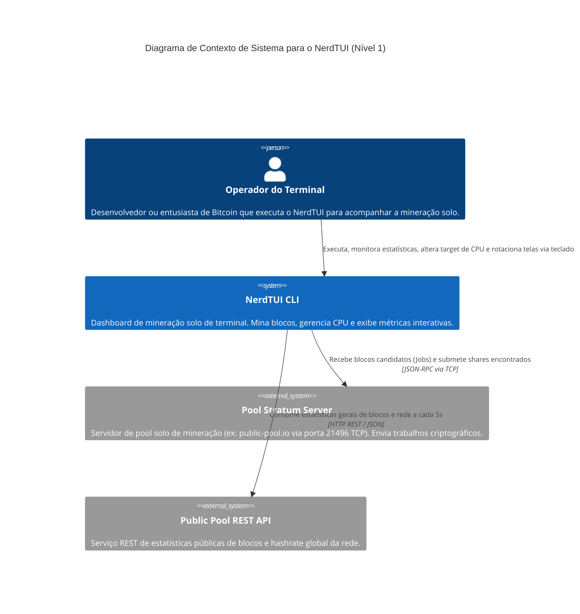

# C4 Diagrama de Contexto (Nível 1) — nerdminertui

> **Módulo:** Arquitetura Global  
> **Nível de Documentação:** COMPLETO  
> **Gerado pelo Arquiteto em:** 2026-05-29

Este diagrama contextualiza o **NerdTUI** em seu ecossistema, mapeando os usuários e os sistemas externos de integração.

