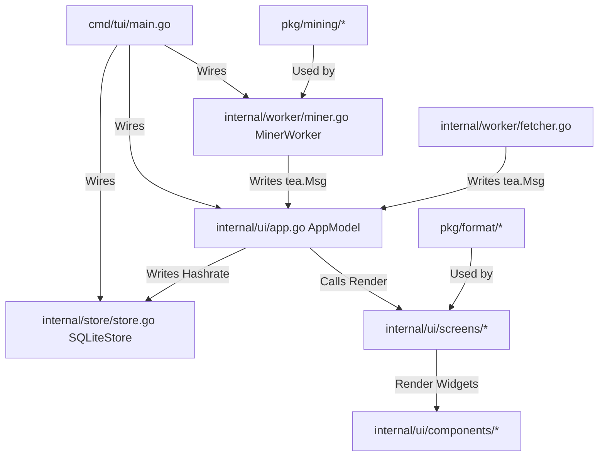

# Análise Técnica Consolidada — nerdminertui

> **Status:** Mapeamento de Especificações Greenfield (Design)  
> **Nível de Documentação:** COMPLETO  
> **Gerado pelo Archaeologist em:** 2026-05-29

---

## 1. Visão Geral da Arquitetura e Fluxo de Controle

O **NerdTUI** é construído sobre o padrão **Model-Update-View (MUV)** do framework Bubbletea (`github.com/charmbracelet/bubbletea`), que serve como orquestrador central e loop de eventos de toda a TUI. A concorrência em segundo plano e a lógica de mineração são desacopladas por completo da interface gráfica e se comunicam através de canais Go nativos e tipos de mensagens explícitas (`tea.Msg`).

---

## 2. Decomposição Detalhada dos Módulos

### 2.1 `cmd/tui`
* **Propósito**: Inicialização e wiring.
* **Componentes Principais**: `main.go`.
* **Fluxo de Controle**:
  1. Parse de flags de linha de comando (`--config`, `--no-mine`, `--cpu`).
  2. Executa `config.Load()` para leitura de configurações.
  3. Abre banco SQLite usando `store.New()`.
  4. Instancia e executa channels para o `MinerWorker`.
  5. Roda loop Bubbletea com altscreen ativo (`tea.WithAltscreen()`).
* **Tratamento de Erros**: Falhas de inicialização são fatais (`log.Fatal`). Código de produção nunca panics após startup bem-sucedido.
* **Escala de Confiança**: 🟢 CONFIRMADO

### 2.2 `internal/config`
* **Propósito**: Carregamento e validação de configurações.
* **Componentes Principais**: `config.go`.
* **Fluxo de Controle e Lógica**:
  * Lê do arquivo local e sobrepõe com envs do sistema usando `viper`.
  * Valida integridade através de `Validate() error`.
* **Regras de Validação**:
  * Falha se o endereço BTC estiver em branco e `MockMining=false`.
  * Falha se `CPUTarget` estiver fora do intervalo `[0.05, 1.0]`.
* **Escala de Confiança**: 🟢 CONFIRMADO

### 2.3 `internal/model`
* **Propósito**: Definir constantes globais e o modelo de estado de dados imutável.
* **Componentes Principais**: `state.go`.
* **Fluxo de Controle e Lógica**:
  * O estado global `AppState` é passado por valor (sem ponteiros) para evitar corridas de dados (`data races`).
  * `WithHashRate(hps float64)` retorna uma nova cópia de `AppState` com `HashRate` atualizado e insere o HPS no histórico circular `[60]float64` (FIFO).
* **Escala de Confiança**: 🟢 CONFIRMADO

### 2.4 `internal/worker`
* **Propósito**: Operar loops assíncronos de mineração e rede.
* **Componentes Principais**: `miner.go`, `fetcher.go`, `poller.go`, `messages.go`.
* **Lógica e Algoritmo de Mineração (CPU Throttling)**:
  * O loop do minerador executa iterações em batches de `50.000` hashes para calcular a taxa de mineração sem bloquear o runtime.
  * O cálculo matemático para controlar o consumo de CPU:
    $$\text{sleep} = \text{workDuration} \times \frac{1 - P}{P}$$
    Onde $P = \text{CPUTarget} \in [0.05, 1.0]$.
  * Medição em tempo real do uso de CPU real:
    $$\text{CPUActual} = \frac{\text{workDuration}}{\text{workDuration} + \text{sleepDuration}}$$
  * Estatísticas são emitidas a cada segundo via `HashRateMsg`. Shares válidos emitem `ShareFoundMsg`.
  * Reconexões do Stratum TCP e chamadas de API HTTP usam poller de retry exponencial.
* **Escala de Confiança**: 🟢 CONFIRMADO

### 2.5 `internal/ui`
* **Propósito**: Apresentar telas interativas e gerenciar teclado.
* **Componentes Principais**: `app.go`, `keys.go`, subpastas `screens/` e `components/`.
* **Fluxo de Controle e State Machine**:
  * Teclas `tab` ou `seta direita` rotacionam telas em ciclo infinito:
    $$\text{Dashboard (0)} \longrightarrow \text{Clock (1)} \longrightarrow \text{Global Stats (2)} \longrightarrow \text{Dashboard (0)}$$
  * Teclas `+` e `-` ajustam `CPUTarget` em passos de `0.05` e escrevem no canal `throttleCh`.
  * Lógicas gráficas de desenho (`screens` e `components`) são projetadas como **funções puras** e determinísticas.
* **Escala de Confiança**: 🟢 CONFIRMADO

### 2.6 `internal/store`
* **Propósito**: Persistência de hashrate e shares locais.
* **Componentes Principais**: `store.go`, `migrations.go`.
* **Banco de Dados e Concorrência**:
  * Utiliza SQLite Go puro (`modernc.org/sqlite`).
  * Habilita modo WAL (Write-Ahead Logging) para escrita/leitura concorrente de alta performance.
  * `NilStore` é usada para omitir escrita física na flag `--no-store`.
* **Escala de Confiança**: 🟢 CONFIRMADO

### 2.7 `pkg/mining`
* **Propósito**: Executar funções criptográficas e cálculos de mineração.
* **Componentes Principais**: `hash.go`, `target.go`, `job.go`.
* **Fórmulas e Métodos**:
  * `SHA256d`: Duplo hash SHA256.
  * `MeetsTarget`: Compara hash big-endian byte-a-byte contra o target do bloco.
  * `DifficultyFromHash`:
    $$\text{Difficulty} = \frac{\text{Target Genesis}}{\text{Hash as BigInt}}$$
* **Escala de Confiança**: 🟢 CONFIRMADO

### 2.8 `pkg/format`
* **Propósito**: Utilidades de renderização textual pura.
* **Componentes Principais**: `hashrate.go`, `duration.go`, `difficulty.go`.
* **Fórmulas**:
  * Converte hashes/seg em strings arredondadas inteligentes (ex: `H/s`, `KH/s`, `MH/s`).
  * Converte durações em formato estruturado (ex: `"2d 03h 14m"`).
* **Escala de Confiança**: 🟢 CONFIRMADO
