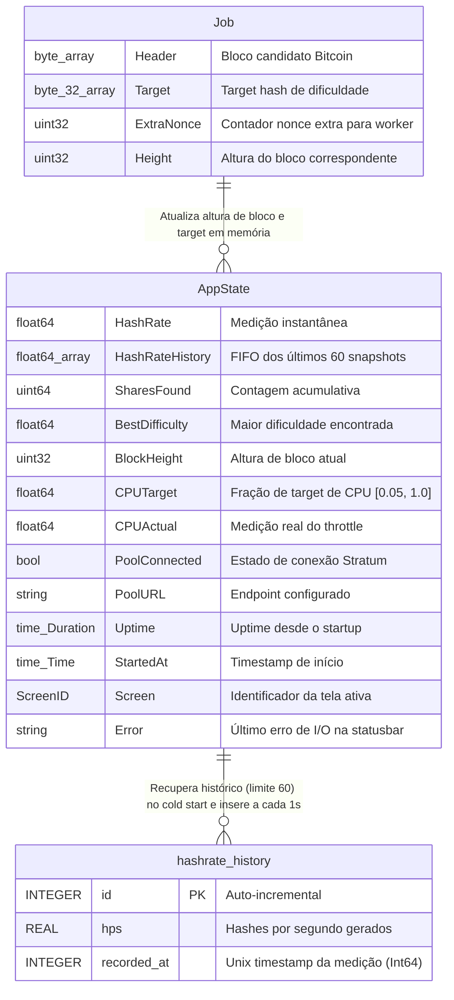

# ERD Completo (Modelo de Dados) — nerdminertui

> **Módulo:** Persistência de Dados  
> **Nível de Documentação:** COMPLETO  
> **Gerado pelo Arquiteto em:** 2026-05-29

Este diagrama de Relacionamento de Entidades (ERD) documenta as tabelas estruturadas no banco SQLite e as relações lógicas com modelos voláteis de memória.

