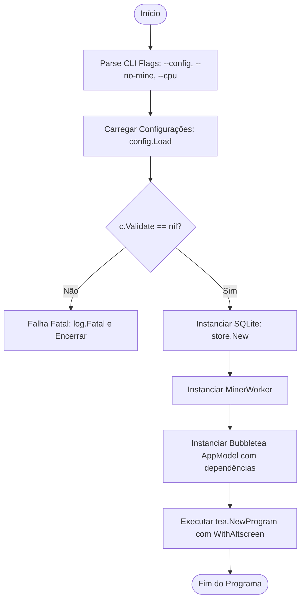

# Fluxograma — cmd/tui

> **Módulo:** `cmd/tui`  
> **Gerado em:** 2026-05-29

Este fluxograma ilustra o processo de inicialização, parsing, wiring e início da aplicação terminal Bubbletea do NerdTUI.

