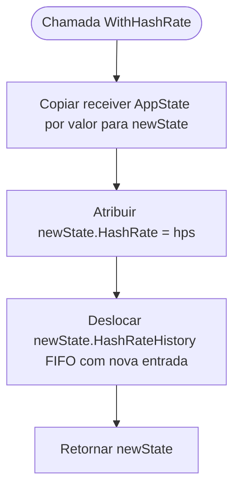

# Fluxograma — internal/model

> **Módulo:** `internal/model`  
> **Gerado em:** 2026-05-29

Este fluxograma ilustra o fluxo de atualização funcional e imutável do receptor `AppState` ao receber novas medições de hashrate.

