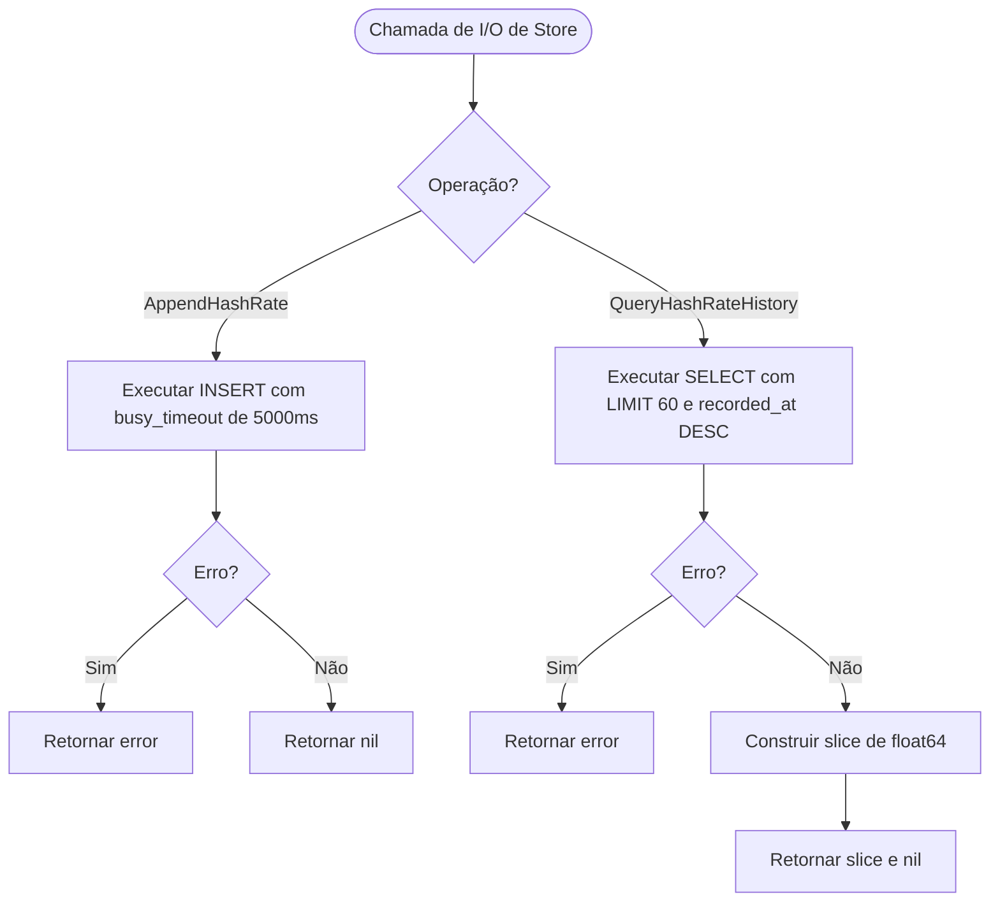

# Fluxograma — internal/store

> **Módulo:** `internal/store`  
> **Gerado em:** 2026-05-29

Este fluxograma ilustra o fluxo de gravação e consulta de histórico concorrente no banco de dados SQLite (WAL Mode) do NerdTUI.

