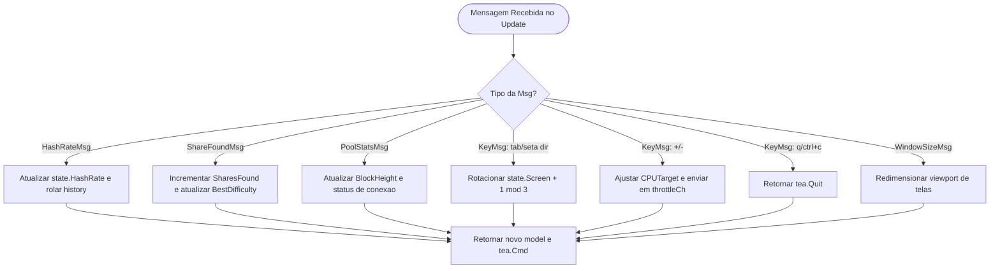

# Fluxograma — internal/ui

> **Módulo:** `internal/ui`  
> **Gerado em:** 2026-05-29

Este fluxograma ilustra o loop principal de dispatch de mensagens do Bubbletea (`Update`) do NerdTUI.

```mermaid
flowchart TD
    Start([Mensagem Recebida no Update]) --> DispatchMsg{Tipo da Msg?}
    
    DispatchMsg -->|HashRateMsg| MsgHPS[Atualizar state.HashRate e rolar history]
    DispatchMsg -->|ShareFoundMsg| MsgShare[Incrementar SharesFound e atualizar BestDifficulty]
    DispatchMsg -->|PoolStatsMsg| MsgPool[Atualizar BlockHeight e status de conexao]
    
    DispatchMsg -->|KeyMsg: tab/seta dir| MsgTab[Rotacionar state.Screen + 1 mod 3]
    DispatchMsg -->|KeyMsg: +/-| MsgCPU[Ajustar CPUTarget e enviar em throttleCh]
    DispatchMsg -->|KeyMsg: q/ctrl+c| MsgQuit[Retornar tea.Quit]
    DispatchMsg -->|WindowSizeMsg| MsgSize[Redimensionar viewport de telas]
    
    MsgHPS --> ReturnCmd[Retornar novo model e tea.Cmd]
    MsgShare --> ReturnCmd
    MsgPool --> ReturnCmd
    MsgTab --> ReturnCmd
    MsgCPU --> ReturnCmd
    MsgQuit --> ReturnCmd
    MsgSize --> ReturnCmd
```
