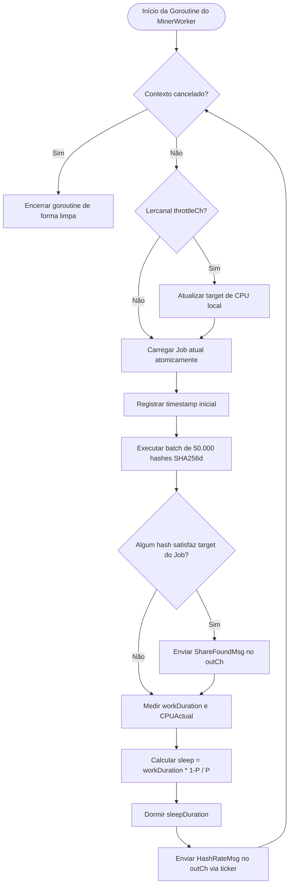

# Fluxograma — internal/worker

> **Módulo:** `internal/worker`  
> **Gerado em:** 2026-05-29

Este fluxograma ilustra o loop assíncrono do `MinerWorker` com CPU throttling e batches de mineração Bitcoin de 50.000 iterações.

