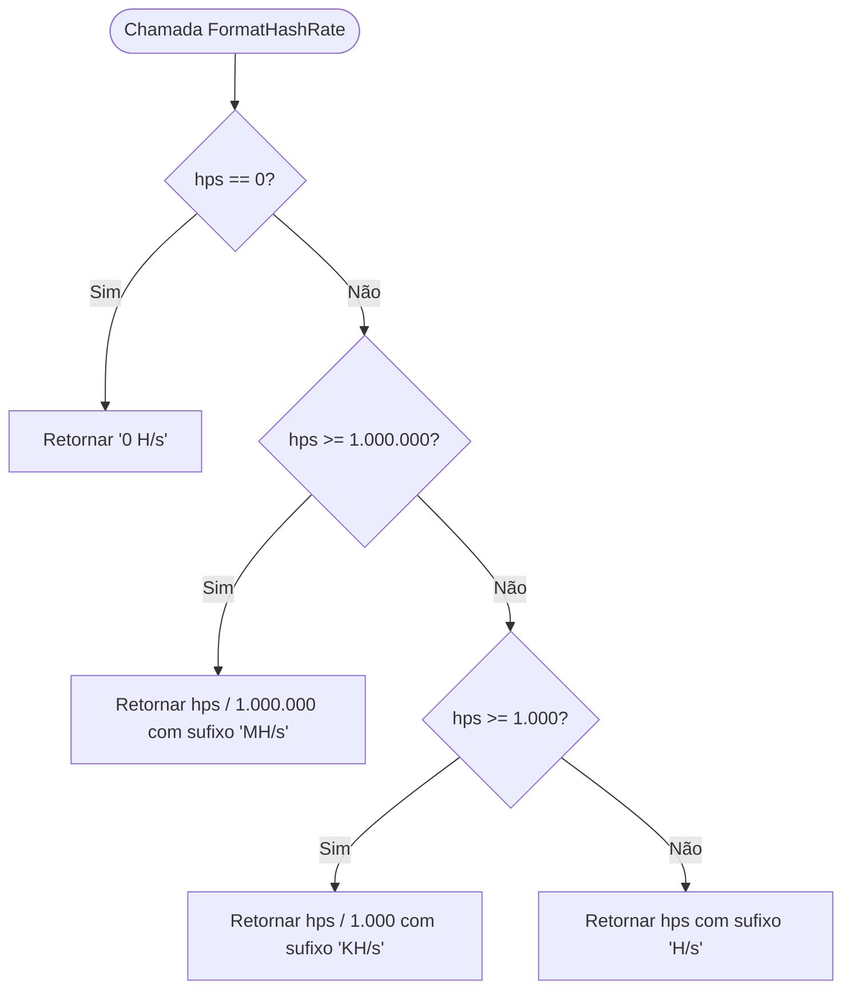

# Fluxograma — pkg/format

> **Módulo:** `pkg/format`  
> **Gerado em:** 2026-05-29

Este fluxograma ilustra o processamento puro de formatação de strings do hashrate atual com divisões e escalas decimais (H/s, KH/s, MH/s).

