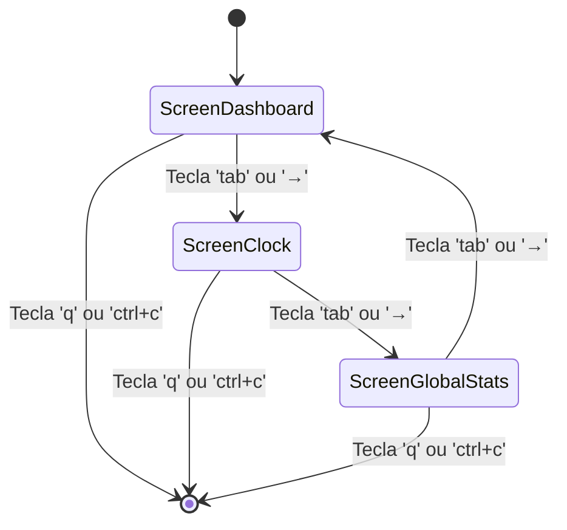
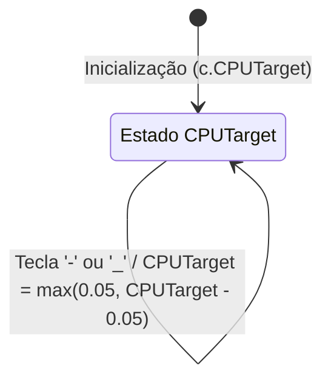
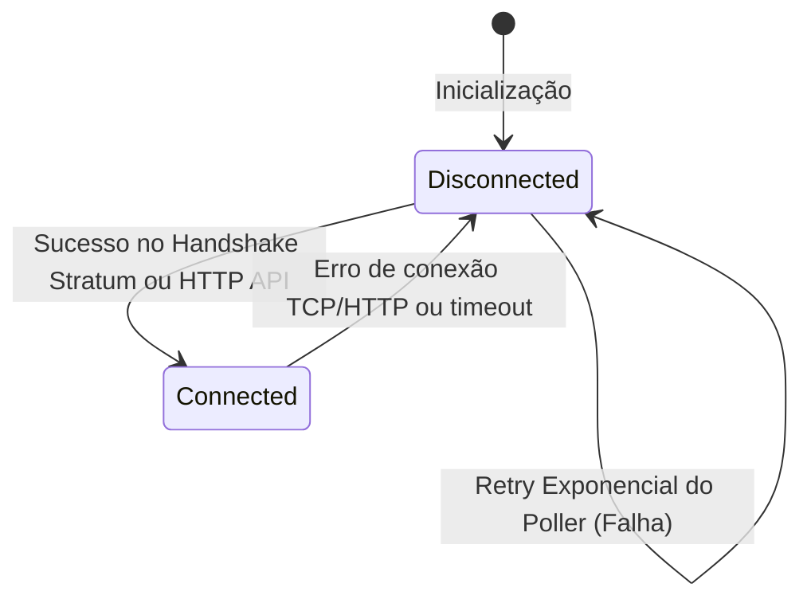

# Máquinas de Estado — nerdminertui

> **Status:** Mapeamento de Especificações Greenfield (Design)  
> **Nível de Documentação:** COMPLETO  
> **Gerado pelo Detetive em:** 2026-05-29

Este documento formaliza as transições de estado comportamentais identificadas na especificação do **NerdTUI**.

---

## 1. Rotação de Telas (UI View States)

O NerdTUI exibe uma de três telas interativas, rotacionadas de forma circular e contínua pelo usuário.

### 1.1 Estados
* `ScreenDashboard (0)`: Tela principal mostrando hashrate, CPU actual/target, shares encontrados e sparkline histórico.
* `ScreenClock (1)`: Relógio grande centralizado em formato ASCII art.
* `ScreenGlobalStats (2)`: Estatísticas globais da rede Bitcoin (hashrate global, bloco atual, dificuldade).

### 1.2 Diagrama de Transição (Mermaid)

---

## 2. Ajuste do Target de CPU (CPU Throttle States)

Gerencia a fração de CPU que o minerador deve consumir através do cálculo de pausas matemáticas.

### 2.1 Estados e Limites
* **Variável**: `CPUTarget` ($\in [0.05, 1.00]$)
* **Incremento/Decremento (`CPUStep`)**: $0.05$ ($5\%$)
* **Clamp de Segurança**:
  * Adicionar além de $1.00$ mantém o target travado em $1.00$.
  * Subtrair abaixo de $0.05$ mantém o target travado em $0.05$.

### 2.2 Diagrama de Transição (Mermaid)

---

## 3. Conexão com a Pool (Network States)

Reflete o estado físico de comunicação TCP/HTTP com o servidor Stratum ou de estatísticas.

### 3.1 Estados
* `Disconnected`: Sem comunicação ou em falha. Tenta reconexão por poller.
* `Connected`: Conectado com sucesso e recebendo dados atualizados da pool.

### 3.2 Diagrama de Transição (Mermaid)

